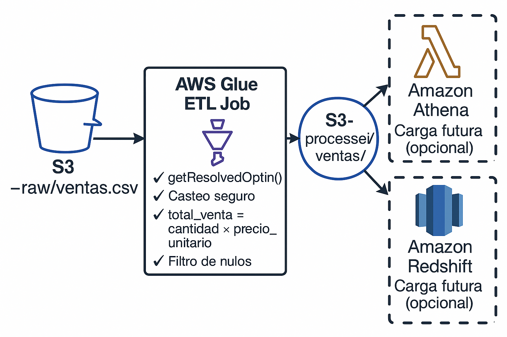

# 🚀 ETL Sales Pipeline with AWS Glue 5.0

| Language | Idioma |
|----------|--------|
| 🇺🇸 English | [Español](#-pipeline-de-procesamiento-de-ventas-con-aws-glue-50)

---

This project implements an AWS Glue 5.0 ETL job to transform raw sales data stored as CSV files in S3 into clean, structured Parquet files. It applies safe type casting, validation, and the calculation of a derived metric (`total_venta`). Designed as a foundational component for modern analytics pipelines.

📄 License: [MIT](LICENSE) — open to use and learn from. See [LICENSE_SPANISH.txt](LICENSE_SPANISH.txt) for a Spanish translation.

## 🧱 Stack

- AWS Glue 5.0 (Spark 3.5, Python 3.11)
- Amazon S3
- PySpark
- Parquet output
- Compatible with Lambda, Airflow, Redshift

## ⚙️ ETL Logic

- **Input**: `s3://data-cgarridolizana/raw/ventas.csv`
- **Transformations**:
  - Cast `cantidad` → `int`
  - Cast `precio_unitario` → `double`
  - Compute `total_venta = cantidad × precio_unitario`
  - Filter invalid rows
- **Output**: `s3://data-cgarridolizana/processed/ventas/` as Parquet

## 🧭 Architecture Diagram

The diagram below illustrates the ETL pipeline implemented using AWS Glue 5.0. It begins with raw CSV ingestion from an Amazon S3 bucket, applies typed transformations and the calculation of a derived business metric (`total_venta`), and outputs the result in Parquet format to a processed S3 location. Future integrations include Redshift, Athena, and Power BI.



## 📌 Sample Code

```python
args = getResolvedOptions(sys.argv, ["JOB_NAME"])
job.init(args["JOB_NAME"], args)
df = df.withColumn("total_venta", F.col("cantidad") * F.col("precio_unitario"))
df_clean.write.mode("overwrite").parquet("s3://.../processed/ventas/")
```

## 🌐 Next Steps

- Trigger via AWS Lambda (event-driven)
- Orchestrate with Apache Airflow
- Load into Amazon Redshift
- Visualize with Power BI or QuickSight

## 📚 Additional Documentation

- [Technical Notes (EN)](docs/technical_notes.md) / [Notas Técnicas (ES)](docs/notas_tecnicas.md)
- [Future Integrations (EN)](docs/future_integrations.md) / [Futuras Integraciones (ES)](docs/futuras_integraciones.md)

---

## 🇪🇸 Pipeline de Procesamiento de Ventas con AWS Glue 5.0

Este proyecto implementa un Job de Glue 5.0 que transforma datos crudos de ventas (en formato CSV en S3) en archivos Parquet estructurados y limpios. Aplica casteo seguro de tipos, validación, cálculo de la métrica derivada `total_venta`, y está preparado para integrarse a un pipeline analítico moderno.

📄 Licencia: [MIT](LICENSE) — uso libre con fines educativos y profesionales. Ver [LICENSE_SPANISH.txt](LICENSE_SPANISH.txt) para una traducción referencial.

## 🧱 Tecnologías

- AWS Glue 5.0 (Spark 3.5, Python 3.11)
- Amazon S3
- PySpark
- Parquet optimizado
- Compatible con Lambda, Airflow y Redshift

## ⚙️ Lógica del ETL

- **Entrada**: `s3://data-cgarridolizana/raw/ventas.csv`
- **Transformaciones**:
  - Cast `cantidad` → `int`
  - Cast `precio_unitario` → `double`
  - Cálculo: `total_venta = cantidad × precio_unitario`
  - Filtro de registros inválidos
- **Salida**: `s3://data-cgarridolizana/processed/ventas/` en Parquet

## 🧭 Diagrama de Arquitectura

El siguiente diagrama representa el pipeline ETL desarrollado con AWS Glue 5.0. Inicia con la ingesta de archivos CSV crudos desde un bucket de Amazon S3, aplica transformaciones tipadas y el cálculo de la métrica de negocio `total_venta`, y entrega los resultados en formato Parquet en la zona procesada de S3. Se contemplan futuras integraciones con Redshift, Athena y Power BI.


## 📌 Fragmento de Código

```python
args = getResolvedOptions(sys.argv, ["JOB_NAME"])
job.init(args["JOB_NAME"], args)
df = df.withColumn("total_venta", F.col("cantidad") * F.col("precio_unitario"))
df_clean.write.mode("overwrite").parquet("s3://.../processed/ventas/")
```

## 🌐 Próximos pasos

- Activador automático con AWS Lambda  
- Orquestación con Apache Airflow  
- Carga a Redshift para análisis  
- Visualización con Power BI o QuickSight

## 📚 Documentación Adicional

- [Notas Técnicas (ES)](docs/notas_tecnicas.md) / [Technical Notes (EN)](docs/technical_notes.md)
- [Futuras Integraciones (ES)](docs/futuras_integraciones.md) / [Future Integrations (EN)](docs/future_integrations.md)

---

👨‍💻 Created by [Cristobal Garrido](https://github.com/cgarridolizana87) — AWS Data Engineer