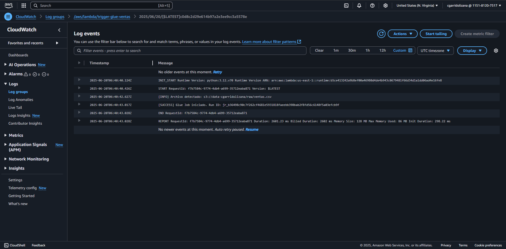

# 🔄 v1 - Lambda Trigger for Glue Job  
<sub>Disparo automatizado del Glue Job mediante Lambda</sub>

This version introduces automation via AWS Lambda. It listens for new `.csv` files in an S3 bucket and automatically triggers the `Procesar_ventas_S3` Glue Job.

<details>
  <summary>🇬🇧 English</summary>

## 🚀 Architecture

```
📁 S3 (PUT .csv in /raw/)
       ▼
🧠 Lambda (Python 3.12)
       ▼
🧩 Glue Job: Procesar_ventas_S3
```

## ⚙️ Tech Specs

- **Language:** Python 3.12
- **Trigger:** S3 Event — `PUT` on `/raw/`
- **Glue Job:** `Procesar_ventas_S3`
- **IAM Policy:** allows `glue:StartJobRun` for the job ARN
- **Log Tracking:** CloudWatch (print-based)

## 🧪 Test it

1. Upload a file to S3: `raw/ventas_junio.csv`
2. Lambda function auto-triggers
3. Logs confirm detection and Glue Job start

## 📸 Execution Evidence

<details>
  <summary>Click to expand screenshot</summary>



Logs confirm successful file detection, job launch, and runtime tracking (request ID, duration, memory).

</details>

## 🧠 Notes

- This is a minimal MVP focused on event-based automation
- See [`v0-manual`](../v0-manual/) for the manual version
- Next step: orchestrated DAG in [`v2-airflow`](../v2-airflow/)

</details>

<details>
  <summary>🇪🇸 Español</summary>

## 🚀 Arquitectura

```
📁 S3 (PUT .csv en /raw/)
       ▼
🧠 Lambda (Python 3.12)
       ▼
🧩 Glue Job: Procesar_ventas_S3
```

## ⚙️ Detalles técnicos

- **Lenguaje:** Python 3.12
- **Disparador:** Evento S3 (archivo subido a `/raw/`)
- **Glue Job:** `Procesar_ventas_S3`
- **Permisos IAM:** acceso a `glue:StartJobRun` sobre el ARN del job
- **Logs:** enviados a CloudWatch (print)

## 🧪 Cómo probarlo

1. Subí un archivo al bucket S3: `raw/ventas_junio.csv`
2. Lambda se dispara automáticamente
3. Logs confirman detección y ejecución del Glue Job

## 📸 Evidencia de ejecución

<details>
  <summary>Ver imagen de ejecución</summary>


La captura muestra detección del archivo, inicio del Glue Job y datos como duración, memoria y request ID.

</details>

## 🧠 Notas

- Esta es una versión MVP enfocada en automatización por eventos
- Ver [`v0-manual`](../v0-manual/) para el enfoque manual
- Próximo paso: orquestación declarativa en [`v2-airflow`](../v2-airflow/)

</details>
